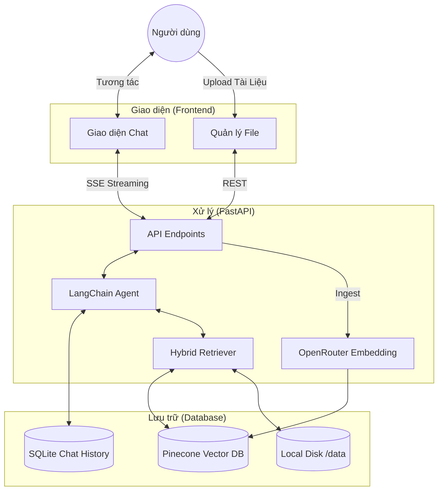

# 🤖 RAG Chatbot — Local Development

> Local RAG chatbot với OpenRouter, Pinecone, LangChain, React (Vite)

## 🏗️ Sơ đồ hoạt động (System Architecture)



## 🗺️ Luồng xử lý (System Flow)

### 1. Luồng nạp tài liệu (Ingestion)
```text
┌──────────────────────────┐      ┌──────────────────────────┐
│   File (.pdf, .txt...)   │ ───> │  Text Splitter (Chunks)  │
└──────────────────────────┘      └────────────┬─────────────┘
                                               │
                                               v
┌──────────────────────────┐      ┌──────────────────────────┐
│   Pinecone Vector DB     │ <─── │ OpenRouter (Embeddings)  │
└──────────────────────────┘      └──────────────────────────┘
```

### 2. Luồng trả lời câu hỏi (RAG Chat)
```text
┌──────────────────────────┐      ┌──────────────────────────┐
│    Người dùng hỏi        │ ───> │    Retrieval Service     │
└──────────────────────────┘      └────────────┬─────────────┘
                                               │
             ┌─────────────────────────────────┴┐
             │                                  │
             v                                  v
┌──────────────────────────┐      ┌──────────────────────────┐
│   Pinecone (Tiểu ngữ)    │      │  SQLite (Lịch sử chat)   │
└────────────┬─────────────┘      └────────────┬─────────────┘
             │                                  │
             └────────────────┬─────────────────┘
                              │
                              v
┌──────────────────────────┐      ┌──────────────────────────┐
│  Prompt Builder (Prompt) │ ───> │ OpenRouter (Gemini LLM)  │
└──────────────────────────┘      └────────────┬─────────────┘
                                               │ (Streaming)
                                               v
                                  ┌──────────────────────────┐
                                  │ UI (Câu trả lời + Nguồn) │
                                  └──────────────────────────┘
```

## 💡 Cơ chế hoạt động (How it works)

### 1. Quy trình nạp dữ liệu (Document Ingestion)
1. **Upload**: Tệp tin (PDF, TXT, MD...) được tải lên và lưu vào thư mục `backend/data/`.
2. **Chunking**: LangChain tiến hành chia nhỏ tài liệu thành từng đoạn văn bản (chunks) khoảng 1000 ký tự để tối ưu hóa việc tìm kiếm.
3. **Embedding**: Từng đoạn văn bản được gửi tới OpenRouter để tạo ra **Vector** (tọa độ không gian) bằng model `text-embedding-3-small`.
4. **Vector Storage**: Các vector được lưu vào **Pinecone** kèm theo thông tin `metadata` (tên file, trang, nội dung thô).

### 2. Quy trình trả lời câu hỏi (RAG Retrieval)
1. **Embedding Query**: Câu hỏi của bạn được chuyển đổi thành một vector toán học.
2. **Semantic Search**: Hệ thống so sánh vector câu hỏi với hàng ngàn vector trong **Pinecone** để tìm ra 5 đoạn văn bản có nội dung liên quan nhất.
3. **Context Construction**: 
    - Lấy nội dung của 5 đoạn văn bản trên làm "ngữ cảnh".
    - Truy vấn **SQLite** để lấy thêm lịch sử của các tin nhắn trước đó (Memory).
4. **LLM Generation**: Toàn bộ (Ngữ cảnh + Lịch sử + Câu hỏi mới) được gửi tới **Gemini 2.0 Flash** qua OpenRouter.
5. **Streaming**: AI phân tích và trả về câu trả lời dưới dạng **SSE (Server-Sent Events)**, giúp nội dung hiện ra tức thì trên giao diện.

## 🛠️ Công nghệ sử dụng (Tech Stack)

| Thành phần | Công nghệ | Chi tiết |
|:---|:---|:---|
| **Frontend** | React 18 + Vite | Giao diện hiện đại, tốc độ build nhanh với TypeScript. |
| **Styling** | Vanilla CSS | Tùy biến linh hoạt, thiết kế Premium/Dark Mode. |
| **Backend** | FastAPI (Python) | High-performance, async framework hỗ trợ SSE (Server-Sent Events). |
| **Framework RAG** | LangChain | Quản lý luồng truy xuất, Agent và Memory (Chat History). |
| **LLM Model** | OpenRouter (Gemini) | Sử dụng `google/gemini-2.0-flash-001` để trả lời câu hỏi. |
| **Embedding** | OpenRouter (OpenAI) | Model `text-embedding-3-small` (1536d) để vector hóa văn bản. |
| **Vector DB** | Pinecone | Lưu trữ và tìm kiếm vector (thông tin tài liệu) dạng Serverless. |
| **Memory** | SQLite | Lưu trữ lịch sử hội thoại bền vững cho từng Session. |
| **Search Engine**| Hybrid Search | Kết hợp Semantic Search (Vector) và BM25 (Keyword search). |

---

## 🌟 Tính năng nổi bật

- ✅ **SSE Streaming** — câu trả lời xuất hiện real-time từng token sinh động.
- ✅ **Source Citations** — trích dẫn chính xác nguồn tài liệu kèm nội dung liên quan.
- ✅ **Session Management** — lưu và tải lại lịch sử hội thoại từ SQLite.
- ✅ **Document Management** — Giao diện quản lý file: Upload, Xem danh sách & Xóa sạch dữ liệu khỏi Pinecone.
- ✅ **Hybrid Search** — tăng độ chính xác bằng cách kết hợp search theo ý nghĩa và từ khóa.
- ✅ **Docker Ready** — triển khai nhanh chóng với Docker Compose.

---

## 🚀 Hướng dẫn cài đặt

### 1. Cấu hình môi trường
- Tạo file `.env` trong thư mục `backend/` dựa trên `.env.example`.
- Điền các API Key: `OPENROUTER_API_KEY`, `PINECONE_API_KEY`, và thông tin Pinecone Index.

### 2. Cài đặt Backend
```bash
cd backend
python3 -m venv venv
source venv/bin/activate
pip install -r requirements.txt
uvicorn app.main:app --reload --port 8000
```

### 3. Cài đặt Frontend
```bash
cd frontend
npm install
npm run dev
```

---

## 📂 Cấu trúc thư mục

```text
RAG-midterm/
├── backend/
│   ├── app/
│   │   ├── agent.py         # Logic RAG + LLM Agent
│   │   ├── vectorstore.py   # Kết nối Pinecone & Embeddings
│   │   ├── ingest.py        # Pipeline nạp và xử lý tài liệu
│   │   ├── memory.py        # Quản lý SQLite history
│   │   └── main.py          # Khai báo các API endpoints
│   ├── data/                # Nơi chứa tài liệu đã upload & DB
│   └── requirements.txt     # Danh sách thư viện Python
├── frontend/
│   ├── src/components/      # Các UI Components (Sidebar, FileManager...)
│   └── lib/api.ts           # Client giao tiếp với Backend
└── docker-compose.yml       # Cấu hình Deploy Docker
```

## 📡 API Endpoints chính

| Method | Endpoint | Mô tả |
|:---|:---|:---|
| `POST` | `/chat` | Chat với AI (hỗ trợ stream SSE) |
| `POST` | `/ingest` | Upload và đánh index tài liệu vào Pinecone |
| `GET` | `/files` | Liệt kê danh sách tài liệu đã tải lên |
| `DELETE` | `/files/{name}` | Xóa tài liệu khỏi Disk và Pinecone |
| `GET` | `/sessions/{id}/history` | Tải lại lịch sử tin nhắn của một phiên |
| `DELETE` | `/sessions/{id}` | Xóa phiên hội thoại |
